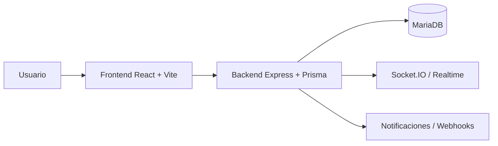

# Sincro — Gestión de turnos, ausencias y planificación operativa

### Plataforma full stack para la administración de equipos con trazabilidad, alcance por rol y notificaciones en tiempo real

**Sincro** es una solución integral para la **gestión de turnos, ausencias, usuarios, auditoría y notificaciones** en tiempo real. Originalmente concebida como una aplicación interna por un equipo de 3 personas, este repositorio representa un **port** que realicé en poco tiempo para migrar la aplicación a una **plataforma full stack** moderna con arquitectura modular, validada por tests y desplegable con Docker.

> **El equipo original:** Mientras mis compañeros se encargaron de la maquetación y el diseño visual, yo me ocupé al 100% del backend, la lógica de negocio, la contenedorización, la evolución técnica del producto y la integración del frontend con la API. Dentro de mis labores en frontend fué implementar componentes funcionales con filtrado, ordenamiento, páginado que sean escalables y adaptables en diferentes páginas.

---

## Tabla de Contenidos

- [Mi Rol y Enfoque como Desarrollador Backend](#mi-rol-y-enfoque-como-desarrollador-backend)
- [Características Clave e Impacto](#características-clave-e-impacto)
- [Impacto en la Empresa](#impacto-en-la-empresa)
- [Arquitectura del Sistema](#arquitectura-del-sistema)
- [Behavior-Driven Development (BDD)](#behavior-driven-development-bdd)
- [Tests](#tests)
- [Tecnologías Utilizadas](#tecnologías-utilizadas)
- [Endpoints de la API](#endpoints-de-la-api)
- [Cómo Ejecutar el Proyecto](#cómo-ejecutar-el-proyecto)
- [Estructura del Proyecto](#estructura-del-proyecto)
- [Flujos Principales](#flujos-principales)
- [Documentación Adicional](#documentación-adicional)

---

## Mi Rol y Enfoque como Desarrollador Backend

> **Sincro nació como una aplicación interna y evolucionó hasta convertirse en una plataforma full stack.** Mi trabajo se centró al 100% en el backend y en la evolución técnica del producto: diseñar e implementar una API REST modular que reemplazara la lógica dispersa del proyecto original, aplicando principios de arquitectura limpia, seguridad por capas y testing riguroso.

### Mi Contribución al Proyecto

Participación activa en el **diseño de la arquitectura**, la **implementación del backend modular**, la **contenedorización con Docker** y la **mejora progresiva** de la experiencia de administración por medio de componentes frontend funcionales.

#### Definición de la lógica de negocio para permisos y flujos de proceso

Más allá del código, definí la **lógica de negocio** que gobierna cómo se relacionan los permisos, los roles y el alcance de datos en la aplicación. Esto incluye:

- **Sistema de permisos nominales**: 49 permisos granulares (`users:view`, `schedules:create`, `planning:view`, etc.) que permiten un control preciso sobre qué puede hacer cada rol, en lugar de depender únicamente del nombre del rol.
- **Matriz de permisos por rol**: Cada rol (`admin`, `general_manager`, `department_manager`, `employee`) tiene una combinación específica de permisos definida en `DEFAULT_ROLE_PERMISSIONS`, documentada en `PERMISOS.md` con tabla visual.
- **Alcance de datos (scope)**: No basta con tener un permiso — el sistema valida además que el usuario pueda operar sobre los datos de su sucursal, departamento o ámbito visible (`visibleBranchIds`). Un gerente general puede tener `users:view` pero solo ver usuarios de su sede.
- **Flujos de proceso correctos**: Definición de flujos como el de ausencias colindantes (detección automática de solapamientos), política de cambio de contraseña progresiva (warning → deadline → force), y reglas de soft-delete vs hard-delete con verificación de dependencias.
- **Trazabilidad completa**: Cada operación sensible queda registrada en el módulo de auditoría con capacidad de rollback, y las notificaciones siguen flujos controlados por permisos y alcance.

Toda esta lógica está documentada en [`BusinessLogic.md`](BusinessLogic.md) (reglas de dominio y alcance) y [`PERMISOS.md`](PERMISOS.md) (matriz de permisos y rutas protegidas), que mantengo sincronizados con el código fuente.

---

#### 1. Diseño de Arquitectura — Arquitectura Modular por Dominios

> Este backend sigue una **arquitectura modular por dominios** con capas claras. Cada módulo de negocio (usuarios, turnos, ausencias, etc.) concentra su propio router, servicios, validaciones y acceso a datos, sin acoplamiento cruzado entre dominios.

**Principios aplicados:**

- **Modularidad por dominio**: Cada funcionalidad de negocio vive en su propio módulo dentro de `backend/src/modules/`
- **Separación de responsabilidades**: Capas bien definidas (router → service → validación → acceso a datos)
- **Inyección de dependencias**: Servicios desacoplados mediante interfaces y factories
- **Middleware centralizado**: Autenticación, permisos y manejo de errores en `backend/src/middleware/`

**Módulos del backend:**

| Módulo | Responsabilidad |
|--------|----------------|
| `auth/` | Autenticación JWT, refresh tokens, cambio de contraseña, rate limiting |
| `users/` | CRUD usuarios, importación CSV, reactivación, asignación de skills, política de cambio de contraseña |
| `schedules/` | Gestión de turnos, guardias, resumen semanal, alertas |
| `planning/` | Planificación con cobertura, disponibilidad, riesgos, equidad, matriz, crisis, sustitutos, timeline, comentarios, preferencias |
| `absences/` | Gestión de ausencias, aprobación/rechazo, calendario, detección de colindantes |
| `branches/` | Sucursales, departamentos, festivos |
| `departments/` | Departamentos y asignación de managers |
| `roles/` | Roles y matriz de permisos nominales (49 permisos) |
| `skills/` | Catálogo de skills y asignación a usuarios |
| `notifications/` | Notificaciones salientes, logs, reenvío, resúmenes programados (viernes, ausencias) |
| `in-app-notifications/` | Notificaciones en tiempo real vía Socket.IO |
| `audit/` | Trazabilidad de cambios, exportación, rollback |
| `webhooks/` | Webhooks para integraciones externas, control de acceso por sede |
| `schedule-types/` | Tipos de turno (mañana, tarde, noche, etc.) |
| `shift-presets/` | Presets de turno para planificación rápida |
| `settings/` | Configuración del sistema (API retirada, identidad visual fija en frontend) |
| `common/` | Utilidades compartidas: chequeo de dependencias, utilidades de manager, reactivación |

---

#### 2. Backend que construí — Capas y Componentes

Mi backend no se limita a guardar y recuperar datos; ejecuta reglas de negocio con alcance por rol y trazabilidad completa.

##### 2.1. Middleware (5 middleware)

| Middleware | Propósito |
|-----------|-----------|
| `auth.middleware.ts` | Verificación y decodificación de JWT |
| `permission.middleware.ts` | Control de permisos nominales con `requirePermission` / `requireAnyPermission` |
| `csrf.middleware.ts` | Protección CSRF con token rotado en cada petición mutativa |
| `errorHandler.middleware.ts` | Manejo global de errores con respuestas uniformes |
| `validation.middleware.ts` | Validación de schemas con Zod |

##### 2.2. Capa de Módulos (17 módulos)

Cada módulo sigue una estructura uniforme con separación de responsabilidades:

```
modules/<domain>/
├── <domain>.router.ts       # Definición de rutas Express
├── <domain>.controller.ts   # Handlers HTTP (desacoplados del router)
├── <domain>.service.ts      # Lógica de negocio
├── <domain>.repository.ts   # Acceso a datos (Prisma)
├── <domain>.http.schemas.ts # Schemas Zod de entrada/salida HTTP
├── <domain>.constants.ts    # Constantes del dominio
├── domain/                  # Tipos e interfaces del dominio
└── API.md                   # Documentación del módulo
```

**Módulos destacados:**

- **`users/`**: CRUD completo, importación CSV con validación de alcance, reactivación de usuarios, asignación de skills, reset de contraseña
- **`schedules/`**: Turnos con alcance por sucursal/departamento, resumen semanal, alertas de cobertura
- **`planning/`**: 12 endpoints de planificación: disponibilidad, riesgos de cobertura, equidad, matriz, crisis, sustitutos, timeline, comentarios
- **`absences/`**: Ausencias con flujo de aprobación/rechazo, calendario, detección de colindantes
- **`audit/`**: Trazabilidad completa con exportación y rollback de cambios
- **`notifications/`**: Notificaciones in-app, logs de envío, reenvío, resúmenes programados (viernes, ausencias)

##### 2.3. Capa de Configuración

| Archivo | Propósito |
|---------|-----------|
| `config/database.ts` | Conexión a MariaDB vía Prisma |
| `config/env.ts` | Validación de variables de entorno con Zod |
| `config/logger.ts` | Logger estructurado con Winston |
| `config/socket.ts` | Configuración de Socket.IO para tiempo real |

##### 2.4. Seguridad

- **JWT con access y refresh tokens**: Autenticación stateless con expiración configurable
- **Sistema de permisos nominales**: 49 permisos granulares validados por `requirePermission` / `requireAnyPermission`
- **Alcance de datos (scope)**: Filtros en servicios por sucursal, `visibleBranchIds` y departamento
- **Protección CSRF**: Middleware con token rotado en cada petición mutativa
- **Validación con Zod**: Schemas de validación en cada módulo para datos de entrada
- **Hash de contraseñas**: BCrypt para almacenamiento seguro
- **Rate limiting**: Protección contra fuerza bruta en endpoints de autenticación (5 intentos/60 min para cambio de contraseña, 10 intentos/60 min para reset admin)
- **Política de cambio de contraseña progresiva**: warning → deadline → force
- **Bloqueo de cuenta por intentos fallidos**: 3 umbrales (5, 10, 15 intentos) con bloqueo temporal y deshabilitación

---

#### 3. Testing Riguroso (649 tests backend + 404 tests frontend)

Mi filosofía es: si no está testeado, no está terminado.

**Estrategia de testing:**

- **Tests unitarios puros**: Cada servicio se testea de forma aislada con mocks
- **Tests de integración**: Flujos completos con base de datos de prueba
- **Cobertura de caminos**: Flujo feliz, casos borde (null, vacío, valores límite) y excepciones
- **Nomenclatura BDD**: Tests descriptivos en español
- **Smoke tests con Postman**: 20 endpoints verificados en CI con Newman

**Distribución de tests por módulo (backend):**

| Módulo | Tests | Casos clave |
|--------|-------|-------------|
| `auth/` | ~30 | Login, refresh, rate limiting, cambio contraseña |
| `users/` | ~60 | CRUD, importación CSV, alcance, departamento null |
| `schedules/` | ~80 | CRUD, resumen semanal, alcance, alertas |
| `planning/` | ~40 | Disponibilidad, riesgos, equidad, crisis, matriz |
| `absences/` | ~60 | CRUD, calendario, cancelación, colindantes, alcance |
| `branches/` | ~40 | CRUD, festivos, alcance |
| `departments/` | ~30 | CRUD, auditoría, alcance |
| `roles/` | ~20 | CRUD, permisos |
| `skills/` | ~30 | CRUD, asignación |
| `notifications/` | ~30 | Logs, reenvío, scheduler |
| `in-app-notifications/` | ~20 | CRUD, lectura masiva |
| `audit/` | ~30 | CRUD, exportación, rollback, scheduler |
| `webhooks/` | ~20 | CRUD, test |
| `schedule-types/` | ~20 | CRUD |
| `shift-presets/` | ~20 | CRUD |
| `common/` | ~40 | App error, CSV, middleware, OpenAPI, seguridad |
| `realtime/` | ~10 | Socket.IO |

---

#### 4. Código Limpio y Mantenible

- **Modularidad total**: Cada dominio es independiente y puede modificarse sin afectar a otros
- **Validación centralizada**: Schemas Zod reutilizables en cada módulo
- **Manejo de errores consistente**: Middleware global que captura y formatea todas las excepciones
- **Logging estructurado**: Winston con niveles DEBUG/INFO/WARN/ERROR según criticidad
- **Tipado fuerte**: TypeScript en todo el backend con interfaces y tipos explícitos
- **Constantes centralizadas**: Guías de constantes en `CONSTANTS_GUIDE.md` para backend y frontend

---

### En números

| Métrica | Backend (mi foco) | Frontend |
|---------|-------------------|----------|
| **Tests** | 649 | 404 |
| **Suites** | 63 | 63 |
| **Módulos** | 17 dominios | 13+ páginas administrativas |
| **Endpoints REST** | 80+ | — |
| **Middleware** | 5 | — |
| **Permisos nominales** | 49 | — |
| **Patrones** | Modular por dominio, Controller/Service/Repository | TanStack Query, Zustand |
| **Seguridad** | JWT + BCrypt + Zod + CSRF + Rate limiting + permisos nominales + alcance por rol | JWT en sesión + rutas protegidas |

---

## Características Clave e Impacto

### 🏗️ Arquitectura y UX operativa

- **Gestión de usuarios** con CRUD, reactivación, importación CSV y asignación de skills
- **Gestión de turnos, guardias y ausencias** con alcance por sucursal y departamento
- **Planificación** con cobertura, disponibilidad, riesgos y equidad
- **Auditoría y notificaciones** in-app con trazabilidad de eventos relevantes
- **Webhooks** para integraciones externas y notificaciones de estado
- **Frontend** con carga progresiva en la planificación y flujos de confirmación en acciones sensibles

### 📦 Contenedorización

- **Docker Compose** con 3 servicios: MariaDB, Backend (Node.js), Frontend (React + Vite)
- **Dockerfiles separados** para backend y frontend con multi-stage build
- **Nginx** para servir frontend en producción
- **Volúmenes persistentes** para datos de BD y logs
- **Healthchecks** en todos los servicios para orquestación robusta

### 🔒 Seguridad

- **Autenticación JWT** con access y refresh tokens
- **Sistema de permisos nominales**: 49 permisos granulares (`users:view`, `schedules:create`, `planning:view`, etc.)
- **Control de alcance por rol**: Administrador, Gerente General, Responsable de departamento, Empleado
- **Alcance de datos (scope)**: Filtros por sucursal, `visibleBranchIds` y departamento en servicios
- **Protección CSRF**: Middleware con token rotado en cada petición mutativa
- **Validación de entrada** con Zod en cada endpoint
- **Hash de contraseñas** con BCrypt
- **Rate limiting** en endpoints de autenticación
- **Política de cambio de contraseña progresiva**: warning → deadline → force
- **Bloqueo de cuenta por intentos fallidos**: 3 umbrales progresivos
- **Trazabilidad completa** con módulo de auditoría y rollback

### 🔄 CI/CD

- **GitHub Actions** con pipeline completo:
  - Backend: lint + typecheck + tests (649 tests)
  - Frontend: lint + typecheck + tests (404 tests)
  - Docker build check
  - **Smoke tests con Postman/Newman**: 20 endpoints verificados contra el backend desplegado en CI

---

## Impacto en la Empresa

### Beneficios cuantificables

| Métrica | Impacto |
|---------|---------|
| **Centralización de datos** | Evita silos entre áreas y mejora la coherencia operativa |
| **Automatización** | Reduce tareas manuales en planificación, usuarios y notificaciones |
| **Trazabilidad** | Facilita auditoría de cambios y reversión de acciones compatibles |
| **Visibilidad** | Hace más fácil detectar coberturas débiles, ausencias y riesgos |
| **Integración** | Abre la puerta a webhooks y automatización externa |

### Valor diferencial

1. **Reglas de negocio**: La aplicación no solo guarda datos — expone reglas de negocio y alcance por rol
2. **Escalabilidad modular**: El sistema está preparado para crecer por módulos sin romper contratos existentes
3. **UX operativa real**: La experiencia de administración está pensada para uso operativo real, no solo para demo
4. **Calidad validada**: 1053 tests (backend + frontend) + smoke tests en CI como red de seguridad

---

## Arquitectura del Sistema

Sincro sigue una arquitectura modular por dominios con capas claras en backend. En lugar de mezclar la lógica, cada módulo concentra su propio router, servicios, validaciones y acceso a datos.



### Stack técnico

- **Backend:** Node.js, Express 5, TypeScript, Prisma 6, MariaDB, Winston, Socket.IO 4, Zod 4.
- **Frontend:** React 19, Vite 8, TypeScript, TanStack Query 5, Zustand 5, Tailwind CSS 4, FullCalendar 6, React Router 7.
- **Infraestructura:** Docker Compose, Dockerfiles separados, Nginx para servir frontend en producción.
- **Calidad:** Jest 30 en backend, Vitest 4 + Testing Library en frontend, ESLint 10 en ambos.

### Capas principales

- `backend/src/modules/` agrupa la lógica por dominio (17 módulos)
- `backend/src/middleware/` concentra autenticación, permisos, CSRF y manejo de errores
- `backend/src/config/` contiene configuración, conexión de datos y entorno
- `frontend/src/pages/admin/` concentra la interfaz administrativa (13+ páginas)
- `frontend/src/hooks/` encapsula llamadas y estado derivado del backend (24 hooks)

---

## Behavior-Driven Development (BDD)

El desarrollo se apoya en BDD: los tests describen comportamiento observable, no detalles internos de implementación.

### Principios aplicados

- Los nombres de los tests expresan comportamiento esperado
- Se validan caminos felices y también errores, límites y permisos
- La lógica compleja se testea con mocks para aislar cada unidad
- Los flujos sensibles se cubren con pruebas de integración o smoke tests

### Resultado

- El backend valida reglas de negocio, alcance y contratos de API
- El frontend valida interacciones críticas, formularios y navegación
- La suite completa sirve como red de seguridad para refactors futuros

---

## Tests

### Backend

- `63` suites pasadas
- `649` tests pasados y `1` omitido en la validación más reciente
- Comando:

```bash
cd backend
npm test
```

### Frontend

- `63` suites pasadas
- `404` tests pasados
- Comando:

```bash
cd frontend
npm run test
```

### Smoke Tests (Postman)

El proyecto incluye una colección de Postman (`backend/test/postman/Sincro.API.Deployment.postman_collection.json`) que verifica **20 endpoints clave** del backend. Se ejecuta automáticamente en CI con Newman.

```bash
npx newman run backend/test/postman/Sincro.API.Deployment.postman_collection.json \
  -e backend/test/postman/Sincro.local.postman_environment.json \
  --env-var "baseUrl=http://localhost:13001"
```

### Validación rápida recomendada

```bash
cd backend && npm run lint && npm test
cd frontend && npm run lint && npm run test
```

---

## Tecnologías Utilizadas

### Backend

- Node.js 22+
- Express 5
- TypeScript 6
- Prisma ORM 6
- MariaDB 10.11
- Socket.IO 4
- Winston
- Zod 4
- Jest 30

### Frontend

- React 19
- Vite 8
- TypeScript 6
- TanStack Query 5
- Zustand 5
- Tailwind CSS 4
- Axios
- React Router 7
- FullCalendar 6
- Vitest 4

### Infraestructura

- Docker y Docker Compose
- Nginx
- MariaDB
- GitHub Actions

---

## Endpoints de la API

Los endpoints principales están organizados por dominio. Esta lista resume los más relevantes del proyecto.

### Autenticación

- `POST /api/auth/login`
- `POST /api/auth/refresh`
- `POST /api/auth/logout`
- `GET /api/auth/me`
- `PATCH /api/auth/change-password`

### Usuarios

- `GET /api/users`
- `GET /api/users/:id`
- `POST /api/users`
- `PATCH /api/users/:id`
- `PATCH /api/users/:id/status`
- `PATCH /api/users/:id/role`
- `DELETE /api/users/:id`
- `POST /api/users/import`
- `POST /api/users/:id/reset-password`
- `POST /api/users/:id/force-password-change`
- `GET /api/users/:id/schedules`

### Skills

- `GET /api/skills`
- `POST /api/skills`
- `PATCH /api/skills/:id`
- `DELETE /api/skills/:id`
- `PUT /api/skills/users/:userId`

### Sucursales, departamentos y roles

- `GET /api/branches`
- `POST /api/branches`
- `PATCH /api/branches/:branchId`
- `DELETE /api/branches/:branchId`
- `GET /api/branches/:branchId/holidays`
- `GET /api/departments`
- `POST /api/departments`
- `PATCH /api/departments/:id`
- `DELETE /api/departments/:id`
- `GET /api/roles`
- `GET /api/roles/permissions`

### Turnos y planificación

- `GET /api/schedules`
- `POST /api/schedules`
- `POST /api/schedules/bulk`
- `PATCH /api/schedules/:id`
- `DELETE /api/schedules/:id`
- `GET /api/schedules/weekly-summary/me/:year/:week`
- `GET /api/schedules/my-weekly-summary/:year/:week`
- `GET /api/schedules/alerts`
- `GET /api/planning/availability`
- `GET /api/planning/coverage-risks`
- `GET /api/planning/equity`
- `GET /api/planning/crisis`
- `GET /api/planning/matrix`
- `GET /api/planning/availability-matrix`
- `GET /api/planning/substitutes`
- `GET /api/planning/timeline`
- `GET /api/planning/template-preview`
- `GET /api/planning/comments`
- `POST /api/planning/comments`
- `GET /api/planning/absence-impact`
- `GET /api/planning/notification-preferences`
- `PATCH /api/planning/notification-preferences`

### Ausencias

- `GET /api/absences`
- `GET /api/absences/calendar`
- `GET /api/absences/:id`
- `POST /api/absences`
- `PATCH /api/absences/:id/approve`
- `PATCH /api/absences/:id/reject`
- `DELETE /api/absences/:id`

### Notificaciones y auditoría

- `GET /api/notifications`
- `GET /api/notifications/logs`
- `POST /api/notifications/resend/:logId`
- `POST /api/notifications/friday-summary`
- `POST /api/notifications/absence-summary`
- `POST /api/notifications/announce`
- `GET /api/in-app-notifications`
- `POST /api/in-app-notifications/read-all`
- `GET /api/audit`
- `GET /api/audit/:id`
- `POST /api/audit/:id/rollback`
- `POST /api/audit/export`

### Webhooks

- `GET /api/webhooks`
- `POST /api/webhooks`
- `PATCH /api/webhooks/:id`
- `DELETE /api/webhooks/:id`
- `POST /api/webhooks/:id/test`

### Tipos de turno

- `GET /api/schedule-types`
- `GET /api/schedule-types/:id`
- `POST /api/schedule-types`
- `PUT /api/schedule-types/:id`
- `DELETE /api/schedule-types/:id`

### Presets de turno

- `GET /api/shift-presets`
- `GET /api/shift-presets/:id`
- `POST /api/shift-presets`
- `PATCH /api/shift-presets/:id`
- `DELETE /api/shift-presets/:id`

---

## Cómo Ejecutar el Proyecto

### Requisitos

- Docker Desktop con Docker Compose
- Node.js 22+
- MariaDB 10.11+ si no usas Docker

### Con Docker

Primero, crea los archivos `.env` a partir de los ejemplos:

```bash
cp backend/.env.example backend/.env
cp frontend/.env.example frontend/.env
```

Luego levanta los servicios:

```bash
docker compose up -d --build
```

Después puedes abrir:

- Frontend: `http://localhost:15173`
- Backend health: `http://localhost:13001/api/health`
- Base de datos: `localhost:13306`

### Sin Docker

```bash
cp backend/.env.example backend/.env
cp frontend/.env.example frontend/.env
```

```bash
cd backend
npm install
npm run dev
```

```bash
cd frontend
npm install
npm run dev
```

### Variables de entorno

- Revisa `BusinessLogic.md` y `PERMISOS.md` si necesitas contexto de alcance y permisos
- Los archivos `.env.example` contienen valores por defecto funcionales para desarrollo local
- En producción, cambia los secretos JWT y la URL de la base de datos

### Verificación con Postman Collection

El proyecto incluye una colección de Postman (`backend/test/postman/Sincro.API.Deployment.postman_collection.json`) que prueba los **20 endpoints principales** de la API.

```bash
# Con Newman (CLI)
npx newman run backend/test/postman/Sincro.API.Deployment.postman_collection.json \
  -e backend/test/postman/Sincro.local.postman_environment.json \
  --env-var "baseUrl=http://localhost:13001"
```

---

## Cuentas de prueba

Estas son las credenciales seed que puedes usar para entrar en la aplicación:

| Usuario | Contraseña | Rol | Sede |
|---|---|---|---|
| `admin@sincro.local` | `AdminPass123!` | Administrador | Todas |
| `manager@sincro.local` | `Manager123!` | Gerente General | Sede principal |
| `gm.gc@sincro.local` | `Manager123!` | Gerente General | Sede secundaria |
| `nuria@company.local` | `User123!` | Empleado | Tenerife |
| `andres@company.local` | `User123!` | Empleado | Tenerife |
| `elena@company.local` | `User123!` | Empleado | Tenerife |
| `mario@company.local` | `User123!` | Empleado | Tenerife |
| `raul@company.local` | `User123!` | Responsable de departamento | Gran Canaria |
| `claudia@company.local` | `User123!` | Empleado | Gran Canaria |
| `ivan@company.local` | `User123!` | Empleado | Gran Canaria |
| `marta@company.local` | `User123!` | Empleado | Gran Canaria |

> Si regeneras el seed, revisa `backend/src/scripts/seeds/08-users.seed.ts` y `backend/src/scripts/seeds.run.ts`.

---

## Estructura del Proyecto

```text
.
├── backend/
│   ├── prisma/
│   ├── src/
│   │   ├── config/
│   │   ├── docs/
│   │   ├── middleware/
│   │   ├── modules/
│   │   ├── realtime/
│   │   ├── scripts/
│   │   └── utils/
│   └── test/
├── frontend/
│   ├── public/
│   ├── src/
│   │   ├── components/
│   │   ├── hooks/
│   │   ├── pages/
│   │   ├── store/
│   │   ├── types/
│   │   └── utils/
│   └── test/
├── BusinessLogic.md
├── PERMISOS.md
├── referencias.md
├── docker-compose.yml
└── README.md
```

---

## Flujos Principales

### Flujo de autenticación

1. El usuario inicia sesión con `POST /api/auth/login`
2. El backend devuelve el token y el frontend lo guarda en su estado de sesión
3. Las rutas protegidas validan rol y alcance antes de renderizar datos

### Flujo de planificación

1. El usuario abre `PlanningPage` — interfaz limpia y modular sin sobrecarga visual
2. Se cargan en paralelo: lookups (sucursales, departamentos), riesgos de cobertura, matriz de disponibilidad y preferencias de notificación
3. Los filtros permiten seleccionar sucursal, departamento y rango de fechas; los DM ven su departamento preseleccionado
4. Las tarjetas de resumen muestran KPIs de cobertura, y la matriz de disponibilidad ofrece vista tabular empleado × día
5. Las preferencias de notificación se muestran como checkboxes horizontales compactos, actualizables al instante
6. Los riesgos de cobertura se presentan en paneles laterales con opción de asignar responsable vía modal
7. En caso de error de carga, se muestra estado con opción de reintentar

### Flujo de importación de usuarios CSV

1. El usuario selecciona un archivo CSV desde `UsersPage`
2. El frontend valida encabezados y contenido base
3. Se consulta el catálogo de sucursales para validar alcance
4. El archivo se envía a `POST /api/users/import`
5. El frontend muestra confirmación y refleja el resultado de la importación

### Flujo de notificaciones y auditoría

1. Los eventos críticos generan notificaciones in-app y registros auditables
2. El backend expone lectura individual y lectura masiva para el panel de notificaciones
3. La auditoría conserva historial y soporta exportación para revisión

---

## Documentación Adicional

| Documento | Descripción |
|-----------|-------------|
| `BusinessLogic.md` | Reglas de negocio, alcance y decisiones funcionales |
| `PERMISOS.md` | Matriz de permisos y alcance por rol |
| `referencias.md` | Referencia técnica completa del proyecto |
| `backend/CONSTANTS_GUIDE.md` | Catálogo de constantes del backend |
| `frontend/CONSTANTS_GUIDE.md` | Catálogo de constantes del frontend |
| `backend/src/docs/` | Documentación de APIs y contratos internos |
| `backend/test/` | Suites de validación y smoke tests del backend |
| `frontend/test/` | Suites de validación del frontend |

---

Sincro se distribuye como una base sólida para operaciones de planificación y administración. Si cambias flujos, permisos o endpoints, mantén sincronizados el código, `BusinessLogic.md`, `PERMISOS.md` y este README.
